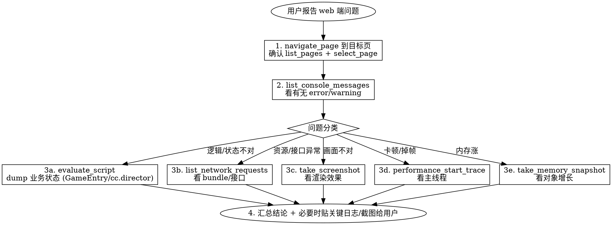

# Cocos Creator Web 端调试（chrome-devtools-mcp）

## Overview

Cocos web 端绝大多数内容渲染在 `<canvas>` 里，不是 DOM。**`mcp__chrome-devtools__*` 工具链是当前项目让 AI 自己抓 web 端运行时数据的标准入口**——console / network / JS 求值 / Canvas 截图 / performance trace / JS 堆 snapshot 都走它，免去用户手动复制粘贴。

## ⚠️ 默认工具路径（不要走错门）

**本 skill 触发后，所有调试操作必须走 `mcp__chrome-devtools__*`。**

抓 console 日志、跑 evaluate_script、抓 network、截图这些功能 `mcp__claude-in-chrome__*` 也有，但**在本 skill 的语境下不要用它**，因为用户专门装 `chrome-devtools-mcp` 就是为了 Cocos web 调试，绕开它等于忽略意图；而且 performance trace / memory snapshot / lighthouse 是 `chrome-devtools-mcp` 独有，混用会导致工作流断片。

**「共用用户日常 Chrome」不是回落理由**——chrome-devtools-mcp 自身有三种连接模式（见下面「前置准备」），可以接管现有 Chrome 实例。除非用户**明确点名**「用 claude-in-chrome / 用我那个扩展」，否则继续留在本 skill 内。

**和其它 MCP 的分工**：

| MCP | 通路 | 何时用 |
|---|---|---|
| `ben-cocos-mcp` / `cocos-mcp-server` | Cocos 编辑器内嵌服务 | 编辑器内节点、Prefab、资源、场景操作（本 skill 不覆盖） |
| `claude-in-chrome` | Chrome 扩展程序 | 用户不想配 `--remote-debugging-port`、想直接复用日常浏览器扩展/登录态的零成本场景 |
| `chrome-devtools-mcp`（**本 skill 默认**） | CDP 协议；项目默认 `--autoConnect` 复用用户日常 Chrome（需 Chrome 144+ + `chrome://inspect/#remote-debugging` 启用 + 授权弹窗 Allow） | Cocos web 端运行时调试、trace / memory / lighthouse（独有） |

## 何时用 / 何时不用

| 场景 | 用本 skill？ |
|---|---|
| 抓 web 端 `Log.d/i/w/e` 输出 | ✅ `list_console_messages` |
| 读 `GameEntry` / `cc.director` / 任意运行时状态 | ✅ `evaluate_script` |
| Cocos bundle / 协议帧 / HTTP 接口 | ✅ `list_network_requests` |
| Canvas 渲染效果对比 | ✅ `take_screenshot` |
| 主线程卡顿 / Long Task / Core Web Vitals | ✅ `performance_start_trace` |
| 节点池 / SpriteFrame / 事件监听泄漏 | ✅ `take_memory_snapshot` |
| 编辑器内节点树 / Prefab / 场景修改 | ❌ 用 `ben-cocos-mcp` |
| 原生（iOS/Android/小程序）调试 | ❌ 本 skill 不覆盖 |
| 用户已经在自己 Chrome 里跑游戏，想让 AI 跟他共用 | ⚠️ 优先 `mcp__claude-in-chrome__*`；非要用本 skill 必须 `--browser-url` 附加 |

## 前置准备（每个会话首次使用）

**确认服务已装**：本项目 `.mcp.json` 默认配置为
```
npx -y chrome-devtools-mcp@latest --autoConnect --no-usage-statistics
```
需要 **Node ≥ 20.19** + **Chrome ≥ 144**（M144 stable 已发布，stable 渠道即可，无需 `--channel=beta`）。

### 推荐工作流：autoConnect 复用日常 Chrome（默认模式）

`--autoConnect` 让 MCP 自动连接到本地正在运行的 Chrome（按 channel 参数对应的 user-data-dir 识别，默认 stable）——**不需要重启 Chrome 加 flag，登录态/扩展/书签全部现成可用**。

**用户首次启用的两步操作**（每次重启 Chrome 后都要重新做一次）：

1. **启用远程调试**：在 Chrome 地址栏打开 `chrome://inspect/#remote-debugging`，按对话框提示允许传入的调试连接。
2. **接受 MCP 连接授权**：第一次调用任意 `mcp__chrome-devtools__*` 工具时，Chrome 会弹一个对话框「Chrome DevTools MCP wants to connect」之类，用户点 **Allow**。

**多 profile 情况**：autoConnect 默认连 Chrome 的 default profile，能访问该 profile 下所有打开的窗口和 tab。用户开了多个 profile 时（例如个人 + 工作），要确认目标 Cocos web 跑在 default profile 里。

### Fallback / 高级模式（用户明确要求时再换）

切换模式要改 `.mcp.json` 的 args 再重启 Claude Code 会话。

| 场景 | 改 args 成 |
|---|---|
| 用户说「就用干净 Chrome，别碰我日常浏览器」 | 删除 `--autoConnect`，可加 `--isolated`（临时 profile，关 Chrome 后自动清空）；MCP 自启独立 Chrome |
| 用户用 `--remote-debugging-port=9222` 起了 Chrome，想直接接管 | 把 `--autoConnect` 换成 `--browser-url=http://127.0.0.1:9222` |
| 远程 Chrome / 自定义鉴权头 | `--wsEndpoint=ws://...` 配 `--wsHeaders='{"Authorization":"Bearer ..."}'`；endpoint 从 `http://<host>:9222/json/version` 的 `webSocketDebuggerUrl` 拿 |
| 跑 headless / CI | 加 `--headless`（无 UI） |

### 打开目标页

```
mcp__chrome-devtools__list_pages                      ← autoConnect 模式必看，找用户已有 tab
mcp__chrome-devtools__select_page(pageId=N)           ← 若 Cocos web 已开，直接选
mcp__chrome-devtools__new_page(url="http://localhost:7456/")  ← 没有再新建
```

Cocos dev server 端口按项目实际为准（必要时先 `Read` `package.json` / 项目 README 确认）。

## 七个核心场景 → 工具对照

### 1. 抓 Cocos 日志（最高频，解决「不用复制粘贴」痛点）

项目 `Log.d/i/w/e()` 底层全部落到 `console.log/info/warn/error`，可直接捕获。

```
mcp__chrome-devtools__list_console_messages          ← 拉所有未读
mcp__chrome-devtools__list_console_messages(types=["error","warning"])  ← 过滤
mcp__chrome-devtools__get_console_message(msgid=N)   ← 看单条详情（含 source map 后的栈）
```

**注意**：`list_console_messages` 只返回**当前 page 自上次 navigation 起**的消息。需要跨刷新看的话加 `includePreservedMessages=true`（最近 3 次 navigation）。

### 2. 注入 JS 读 Cocos 运行时状态

```
mcp__chrome-devtools__evaluate_script(function="() => ({
  scene: cc.director.getScene()?.name,
  fps:   cc.game.frameRate,
  proc:  window.GameEntry?.procedureComponent?.currentState?.constructor?.name,
  uiOpened: window.GameEntry?.uiComponent?.getAllLoadedUIForms()?.map(f => f.uiFormName)
})")
```

**常用 dump 套路**：
- 场景 / 流程：`cc.director.getScene()`、`GameEntry.procedureComponent`
- 资源缓存：`GameEntry.resourceComponent` 上的 cache map
- UI 栈：`GameEntry.uiComponent.getAllLoadedUIForms()`
- 事件总线：`GameEntry.eventComponent`

**注意**：`evaluate_script` 返回值必须 JSON 序列化得了；Cocos `Node`、`SpriteFrame` 这类对象循环引用，需要在 function 内 map 成纯对象。

### 3. Network：bundle / 协议 / HTTP

```
mcp__chrome-devtools__list_network_requests(resourceTypes=["fetch","xhr"])  ← 接口调用
mcp__chrome-devtools__list_network_requests(resourceTypes=["script","image"])  ← bundle 资源
mcp__chrome-devtools__get_network_request(reqid=N)                          ← 看 body
```

**限制**：纯 WebSocket 帧 chrome devtools 只能看到握手和帧 metadata，**业务协议的二进制 payload 解析能力有限**——项目里走自定义协议时，优先用 `evaluate_script` 在 `window.ws.onmessage` 上挂钩子打 log。

### 4. 截 Canvas 实际渲染

```
mcp__chrome-devtools__take_screenshot                ← 全 viewport
mcp__chrome-devtools__take_screenshot(fullPage=true) ← 全文档（cocos 一般就一屏，等价）
```

底层走 puppeteer，**真正拿 WebGL 合成像素**（不是 `canvas.toDataURL`，所以不会黑屏）。
**和编辑器内 `captureSceneView` 区别**：本工具截**运行时浏览器渲染**，那个截**编辑器场景视口**——两者用途不同。

### 5. Performance Trace（卡顿 / 掉帧 / 启动慢）

```
mcp__chrome-devtools__navigate_page(url="http://localhost:7456/", type="url")
mcp__chrome-devtools__performance_start_trace(reload=true, autoStop=true)
  ← 自动重载并在加载稳定后停止；trace 数据返回 + insights
mcp__chrome-devtools__performance_analyze_insight(insightSetId="...", insightName="LCPBreakdown")
```

**能看到**：JS 主线程耗时、Long Task、Layout/Composite、Core Web Vitals（LCP/INP/CLS）、网络瀑布。
**看不到**：WebGL draw call 数、纹理上传耗时、shader 编译——这一层只能靠 Spector.js / chrome://gpu，本 MCP 不覆盖。

### 6. JS 堆 Memory Snapshot（对象池 / SpriteFrame / 监听泄漏）

```
mcp__chrome-devtools__take_memory_snapshot
mcp__chrome-devtools__get_memory_snapshot_details(snapshotId=N)
mcp__chrome-devtools__get_nodes_by_class(snapshotId=N, className="Node")  ← 查 Cocos Node 数量
```

**典型流程**：进入怀疑泄漏的场景 → snapshot A → 切走再回来 → snapshot B → 比对同 class 增量。
**注意**：GPU 显存（纹理、buffer）看不到。

### 7. Lighthouse（仅 accessibility/SEO/best-practices/agentic browsing，性能用 `performance_*`）

Cocos 游戏页一般不跑 lighthouse——SPA + Canvas 评分参考价值低。除非用户明确要求或处理外层落地页才用。

## 工作流：用户报「web 端 X 不对劲」的标准三板斧



## Common Mistakes

| 反面操作 | 原因 / 应改成 |
|---|---|
| 调 `take_snapshot` 抓 DOM 想看 cocos 节点 | Cocos 渲染在 `<canvas>` 内部，DOM 几乎只有 root canvas，没意义 → 用 `evaluate_script` 读 `cc.director.getScene()` |
| 在 `evaluate_script` 里直接返回 `cc.Node` 实例 | 循环引用 JSON 序列化失败 → 在 function 内 pick 纯字段后再返回 |
| 触发 `alert` / `confirm` 后 MCP 阻塞 | 与 `claude-in-chrome` 同样限制，避免点出确认框；若已触发 → `handle_dialog(action="accept")` |
| 用 lighthouse 给 cocos 游戏页打性能分 | 该接口已不含 performance；性能要看 `performance_start_trace` |
| WebSocket 业务协议靠 chrome devtools 看 payload | 二进制帧解析弱 → 在 `evaluate_script` 里 monkey-patch `WebSocket.prototype.send` / `onmessage` 打 log |
| 想看 GPU 显存 / draw call | 本 MCP 看不到 → 用 Spector.js 或 chrome://gpu，要么在 cocos 里读 `cc.profiler` |
| 截图保存路径写到仓库根目录 | 违反项目第 7 节约定 → 截图统一让用户决定路径，或参考 `agent-tools/playwright/screenshots/` 风格 |

## Quick Reference

| 任务 | 工具 |
|---|---|
| 起页 / 切页 | `new_page` · `list_pages` · `select_page` · `navigate_page` · `close_page` |
| 抓日志 | `list_console_messages` · `get_console_message` |
| 跑 JS | `evaluate_script` |
| 抓网络 | `list_network_requests` · `get_network_request` |
| 截图 | `take_screenshot` |
| 性能 | `performance_start_trace` · `performance_stop_trace` · `performance_analyze_insight` |
| 内存 | `take_memory_snapshot` · `get_memory_snapshot_details` · `get_nodes_by_class` |
| 输入模拟（少用） | `click` · `fill_form` · `press_key` · `hover` · `type_text` |
| 仿真 | `emulate`（CPU 节流 / 网络节流 / viewport） |
| 处理弹窗 | `handle_dialog` |

工具完整参数见 https://github.com/ChromeDevTools/chrome-devtools-mcp/blob/main/docs/tool-reference.md
