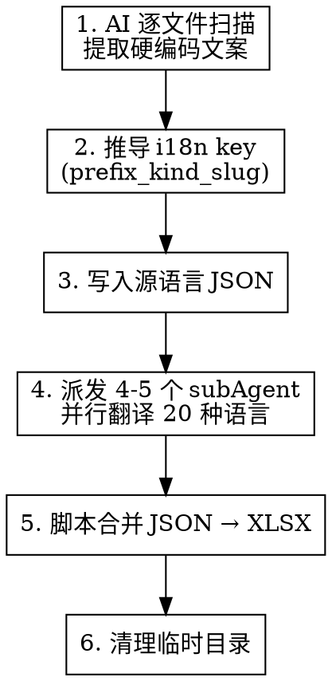

# i18n XLSX Export

## Overview

AI 扫描指定 JS/TS/JSX/TSX 文件中的硬编码 UI 文案，自动推导 i18n key，翻译为 21 种语言，输出标准化 XLSX 国际化表格。

**核心原则**：AI 扫描 + AI 翻译 + 不侵入项目依赖。

## When to Use

- 用户提到"导出文案"、"提取文案"、"export i18n"、"提取多语言"、"硬编码文案"并提供文件/目录路径
- 用户说"把 XXX 里的文案提取出来"、"帮我导出 XXX 的文案"
- 需要将硬编码 UI 文案批量提取为多语言表格
- 重构前需要梳理某个模块的所有用户可见文案

**When NOT to use：**
- 已有 i18n key 的代码（`t('xxx')` 形式）— 本技能忽略这些
- 只需单语言翻译 — 直接用 AI 翻译即可

## Inputs

| 参数 | 必须 | 默认值 | 说明 |
|------|------|--------|------|
| paths | 是 | — | 目标文件或目录（绝对/相对/多个均可） |
| scopePrefix | 否 | 从目录名推导（lowerCamelCase） | key 前缀 |
| tag | 否 | `str`（**固定默认值，不推导**） | 表格"所属标签"列，一般情况下无需修改，除非用户明确指定 |

**调用方式灵活**，以下写法等价，AI 自动解析参数：

```
# 最简写法 — 直接跟路径
导出文案 features/scan-tasks

# 多路径
导出文案 features/scan-tasks app/str/page.tsx

# 带可选参数（任意顺序、任意分隔）
导出文案 features/scan-tasks tag=str
导出文案 features/scan-tasks prefix=marketing tag=web

# 自然语言也行
帮我导出 features/scan-tasks 和 app/str/page.tsx 下的文案
把 src/components/Auth 里的硬编码文案提取成多语言表格
export i18n from src/views/Dashboard

# 结构化写法（也支持）
导出文案 paths: ['features/scan-tasks', 'app/str/page.tsx'] tag: str
```

**解析规则**：
- 路径 = 消息中看起来像文件/目录路径的部分（含 `/`、`.ts` 等）
- `tag=xxx` / `tag: xxx` / `tag xxx` → tag 参数
- `prefix=xxx` / `scopePrefix=xxx` → scopePrefix 参数
- 其余均视为路径或自然语言上下文

## Constraints (Hard Rules)

1. **不修改项目代码或依赖** — 不写 package.json / node_modules
2. **中间产物隔离** — 必须放 `/tmp/i18n_export_{MMddHHmmss}`，完成后清理
3. **严禁扫描/复用现有 key** — 一律按文案推导全新 key
4. **不提交代码** — 不运行构建/测试/格式化
5. **AI 扫描** — 不要用脚本扫描文案，用 AI 逐文件阅读提取
6. **最终 XLSX 输出到项目根目录**
7. **不要遗漏文案**
8. **中间处理必须使用分语言 JSON 文件** — `{临时目录}/<prefix>_<lang>.json`
9. **翻译必须用 subAgent 并行** — 将 20 种目标语言分 4-5 组，用 Agent 工具在单条消息中同时派发，禁止主线程串行逐语言翻译
10. **id 禁止使用点号（`.`）** — key 各段之间统一用下划线 `_` 分隔（如 `stall_error_failedOpen`），不用 `.`
11. **所属标签默认 `str`** — 除非用户明确指定 tag 参数，否则一律填 `str`，不根据模块名推导新标签
12. **XLSX id 不含 tag 前缀** — 代码中的完整 key 格式为 `<tag>_<prefix>_<kind>_<slug>`（如 `str_stall_toast_cannotMove`），但 XLSX 表格的 `id` 列必须去掉 `<tag>_` 前缀（如 `stall_toast_cannotMove`），因为 tag 已在"所属标签"列体现，避免冗余

## Core Workflow



### Step 1: 扫描文案（AI 扫描）

**Include（提取）：** 按钮文案、标题、副标题、描述、占位符、提示、对话、Toast、空态、错误、成功、加载态

**Error Messages（重点识别）：**
- `throw new Error('...')` — 错误抛出语句
- `setError(error, '...')` — 错误设置函数
- `onError: (error) => setError(error, '...')` — 错误回调
- `catch` 块中的错误提示
- 表单验证错误信息、API 请求失败提示

**Exclude（忽略）：** console/debug 日志、测试用例、注释、env/URL/类名/数据键、`t('xxx')` 形式的 i18n key

**Normalize：** 去首尾空白、合并多空格为单空格，保留换行为 `\n`

**Placeholders：** 代码变量占位统一转为 `{var}` 形式（如 `{count}`），保留变量名不翻译

### Step 2: Key 推导

| 部分 | 规则 |
|------|------|
| **Prefix** | 使用 `scopePrefix`；未提供时从模块目录名推导（`features/scan-tasks` → `scanTasks`） |
| **Kind** | 启发式匹配：`title\|subtitle\|desc\|cta\|label\|placeholder\|error\|empty\|success\|failed\|loading\|dialog\|toast` |
| **Slug** | 英文：前 6 有效词、去标点、lowerCamelCase；中文/非拉丁：优先转英文，否则稳定短哈希（6 位）；`{var}` 归一化为 `var` |
| **Separator** | **禁止使用 `.`（点号）**，统一使用 `_`（下划线）作为各段分隔符 |
| **Combine** | 有 kind → `<prefix>_<kind>_<slug>`；无 kind → `<prefix>_<slug>` |
| **Uniqueness** | 冲突时追加 `_v2/_v3...` |

**完整 key vs XLSX id**：
- **代码中使用的完整 key** = `<tag>_` + 推导结果，如 `str_stall_toast_cannotMove`（用于 `getString("str_stall_toast_cannotMove")`）
- **XLSX 表格 id 列** = 推导结果（不含 tag 前缀），如 `stall_toast_cannotMove`（tag 已在"所属标签"列体现）
- **JSON 中间文件的 entries key** = 同 XLSX id，不含 tag 前缀

**Multiple Paths 注意**：如共同上层目录过于通用（如 `features`），应明确到对应模块（`auth`、`collections`），不允许用 `features` 作前缀。

### Step 3-5: 分语言 JSON 文件（subAgent 并行翻译）

在临时目录创建每种语言的独立 JSON 文件（**entries 的 key 不含 tag 前缀**）：

```json
{
  "lang": "zh",
  "entries": {
    "scanTasks_title_quickScan": "快速扫描",
    "scanTasks_desc_selectWallet": "选择钱包地址"
  }
}
```

> 注意：上面的 key 是 `scanTasks_title_quickScan`（不含 `str_`），对应代码中的完整 key 为 `str_scanTasks_title_quickScan`。

**文件命名**：`<prefix>_<lang>.json`（如 `scanTasks_zh.json`、`scanTasks_en.json`）

**翻译执行策略（subAgent 并行）**：

> **核心原则**：翻译阶段必须尽量多地使用 Agent 工具派发 subAgent 并行翻译，最大化利用并发能力。

1. **主线程**先写入源语言 JSON（en 或 zh）
2. **将剩余 20 种语言分为 4-5 组**，每组 4-5 种语言，**在同一条消息中同时派发多个 Agent**（每个 Agent 负责一组语言的翻译 + JSON 写入）：
   - Agent 1: zh, zh-TW, ja, ko（东亚语系）
   - Agent 2: th, vi, id, es, pt（东南亚 + 伊比利亚语系）
   - Agent 3: fr, de, it, ru, tr（欧洲语系 A）
   - Agent 4: ar, pl, ro, cs, hi, hu（欧洲语系 B + 南亚 + 阿拉伯）
3. 每个 Agent 的 prompt 须包含：
   - 完整的源语言 entries（所有 key-value）
   - 负责的目标语言列表
   - JSON 文件格式与输出路径（`/tmp/xxx/<prefix>_<lang>.json`）
   - 翻译规则（见下方）
4. 如果源语言本身是 zh，则 Agent 1 跳过 zh，改为翻译 en + zh-TW + ja + ko
5. 所有 Agent 完成后主线程继续 Step 6

**分组示例（可根据语言数灵活调整，最多 5 个 Agent 并行）**：
```
单条消息中同时派发：
  Agent(prompt="翻译以下文案到 zh, zh-TW, ja, ko...", mode="bypassPermissions")
  Agent(prompt="翻译以下文案到 th, vi, id, es, pt...", mode="bypassPermissions")
  Agent(prompt="翻译以下文案到 fr, de, it, ru, tr...", mode="bypassPermissions")
  Agent(prompt="翻译以下文案到 ar, pl, ro, cs, hi, hu...", mode="bypassPermissions")
```

**翻译规则**（须在每个 Agent prompt 中完整传达）：
- 保留 `{var}` 占位符与格式
- 不翻译变量名与专有名词（品牌、产品名）
- 大小写/标点遵循目标语言习惯
- 风格：短句、自然、本地化表达，避免机翻痕迹

### Step 6: 合并生成 XLSX

使用临时目录内隔离安装的 xlsx 依赖，不影响项目。

**执行模板**：

```bash
# 1) 创建临时文件夹
TEMP_DIR="/tmp/i18n_export_$(TZ='Asia/Shanghai' date +'%m%d%H%M%S')"
mkdir -p "$TEMP_DIR"
cd "$TEMP_DIR"

# 2) 初始化并安装依赖
npm init -y >/dev/null 2>&1
npm install xlsx@0.18.5 --silent >/dev/null 2>&1

# 3) AI 使用 Write 工具创建分语言 JSON 文件到 $TEMP_DIR

# 4) 使用 Write 工具创建 generate-xlsx.js（见下方脚本模板）

# 5) 执行脚本
node generate-xlsx.js

# 6) 清理
cd "<PROJECT_ROOT>" && rm -rf "$TEMP_DIR"
```

**generate-xlsx.js 脚本模板**：

```javascript
const fs = require('fs');
const XLSX = require('./node_modules/xlsx');

const prefix = '<PREFIX>';
const langFiles = fs.readdirSync('.').filter(f => f.startsWith(prefix + '_') && f.endsWith('.json'));

const langColumnMap = {
  'en': '英语(en)', 'zh': '中文(zh)', 'zh-TW': '繁体(zh-TW)',
  'ja': '日语(ja)', 'th': '泰语(th)', 'vi': '越南语(vi)',
  'id': '印尼语(id)', 'it': '意大利语(it)', 'es': '西班牙语(es)',
  'pt': '葡萄牙语(pt)', 'ar': '阿拉伯语(ar)', 'fr': '法语(fr)',
  'de': '德语(de)', 'ru': '俄语(ru)', 'tr': '土耳其语(tr)',
  'pl': '波兰语(pl)', 'ko': '韩语(ko)', 'ro': '罗马尼亚语(ro)',
  'cs': '捷克语(cs)', 'hi': '印地语(hi)', 'hu': '匈牙利语(hu)'
};

const langData = {};
langFiles.forEach(file => {
  const data = JSON.parse(fs.readFileSync(file, 'utf8'));
  const lang = data.lang;
  Object.entries(data.entries).forEach(([key, value]) => {
    if (!langData[key]) langData[key] = { id: key, '所属标签': '<TAG>' };
    const col = langColumnMap[lang];
    if (col) langData[key][col] = value;
  });
});

const finalData = Object.values(langData).sort((a, b) => a.id.localeCompare(b.id));
const wb = XLSX.utils.book_new();
const ws = XLSX.utils.json_to_sheet(finalData, { skipHeader: false });
XLSX.utils.book_append_sheet(wb, ws, 'i18n');
const outputPath = '<PROJECT_ROOT>/<PREFIX>-i18n.xlsx';
XLSX.writeFileXLSX(wb, outputPath);
console.log('XLSX 已生成:', outputPath);
```

**变量替换**：`<PREFIX>` = 实际前缀、`<TAG>` = 标签值、`<PROJECT_ROOT>` = 项目根目录

### Step 7: 清理

`rm -rf $TEMP_DIR` — 删除整个临时文件夹及所有中间文件。

## Sheet Columns (21 Languages)

`id | 所属标签 | 英语(en) | 中文(zh) | 繁体(zh-TW) | 日语(ja) | 泰语(th) | 越南语(vi) | 印尼语(id) | 意大利语(it) | 西班牙语(es) | 葡萄牙语(pt) | 阿拉伯语(ar) | 法语(fr) | 德语(de) | 俄语(ru) | 土耳其语(tr) | 波兰语(pl) | 韩语(ko) | 罗马尼亚语(ro) | 捷克语(cs) | 印地语(hi) | 匈牙利语(hu)`

**Fill Rules：**
- 原文英文 → 填入 `英语(en)`，其余 AI 翻译
- 原文中文 → 填入 `中文(zh)`，其余 AI 翻译
- 其他语种 → 判断最可能语言列填入，其余 AI 翻译

**Sorting：** 以 `id` 升序稳定排序

## Output

最终产出：`<PROJECT_ROOT>/<prefix>-i18n.xlsx`（完成后回传绝对路径）

如需落库，由用户明确同意并指定目标路径后再移动。

## Common Mistakes

| 错误 | 正确做法 |
|------|----------|
| 用脚本正则扫描文案 | 必须 AI 逐文件阅读，脚本会遗漏上下文相关文案 |
| 主线程串行逐语言翻译 | **必须**用 Agent 工具派发 4-5 个 subAgent 并行翻译，每个 Agent 负责 4-6 种语言 |
| 在项目 node_modules 安装 xlsx | 在 `/tmp` 临时目录隔离安装 |
| 复用现有 i18n key | 一律推导全新 key，不扫描/不复用 |
| 遗漏 Error Messages | 重点检查 throw/setError/catch/表单验证 |
| 多目录用过于通用的公共前缀 | 明确到模块级别（`auth` 而非 `features`） |
| JSON 中间文件留在 /tmp | 生成 XLSX 后必须 `rm -rf` 清理 |
| id 中使用 `.`（点号）分隔 | **禁止**：统一用 `_`（下划线）分隔各段，如 `stall_error_failedOpen` |
| 所属标签从模块名推导 | 所属标签**固定 `str`**，除非用户明确用 `tag=xxx` 指定 |
| XLSX id 包含 tag 前缀（如 `str_stall_xxx`） | id 列**必须去掉** tag 前缀（如 `stall_xxx`），tag 已在"所属标签"列体现 |
