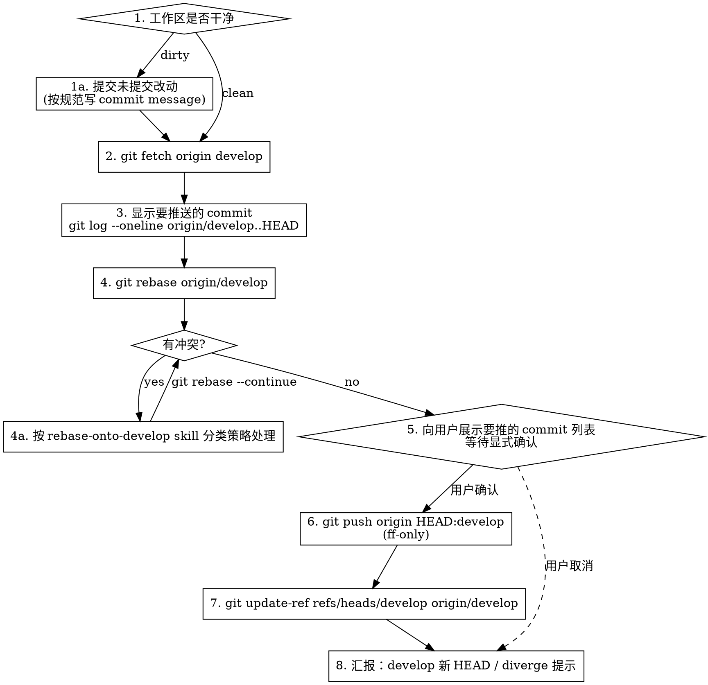

# Merge Current Branch to Develop

## Overview

**方向**：把**当前分支**的改动通过 `rebase + ff-push` 合并到 `origin/develop`（**不是**反过来把 develop 合进 feature —— 那是 `rebase-onto-develop` skill 的职责）。

产出：`origin/develop` 被 fast-forward 到本分支最新 commit，**不产生 merge commit**。

## Workflow



## 项目约定

- **主仓库**：`/Users/liuzhuo/webstorm_project/company-projects/CreatorFramework`
- **develop worktree**：`/Users/liuzhuo/webstorm_project/company-projects/CreatorFramework.worktrees/develop`
- **合并策略**：必须是 **fast-forward**，不允许 merge commit
- **Commit message**：中文描述 + 规范前缀（`fix:` / `feat:` / `refactor:` / `perf:` / `docs:` / `chore:` / `style:`）
- **Commit 签名**：**不加** `Co-Authored-By` 行（遵循用户偏好）

## Step-by-Step

### 1. 预检 + 必要时提交

```bash
git status --short
```

- **工作区干净** → 进入 Step 2
- **有未提交改动** → 针对本次任务文件生成 commit（不要 `-a` 全加，避免夹带无关文件）：

  ```bash
  git add <具体文件路径>
  git commit -m "<前缀>: <中文描述>"
  ```

  Commit message 不加 `Co-Authored-By`。

### 2. Fetch 最新 develop

```bash
git fetch origin develop
```

### 3. 预览要推送的 commit

```bash
git log --oneline origin/develop..HEAD
git log --oneline HEAD..origin/develop   # 可选：看 develop 比本分支多出什么
```

向用户展示当前分支将被推到 develop 的 commit 数量与标题。

### 4. Rebase 到 origin/develop

```bash
git rebase origin/develop
```

**冲突处理**：完整复用 `rebase-onto-develop` skill 的分类策略：
- i18n 单行 JSON / `.meta` 的 uuid-only 冲突 → 自动解
- `.prefab` / `.scene` / 二进制 → 必须询问用户
- 代码冲突 ≤3 处且改动隔离 → 直接解，事后汇报
- 代码冲突 >3 处或逻辑交织 → 询问用户

### 5. 向用户确认推送（**硬性止点**）

rebase 完成后，**必须停下**向用户展示：

- 要推到 develop 的 commit 列表（SHA + title）
- 改动文件与行数（`git diff --stat origin/develop..HEAD`）
- 明确说："将执行 `git push origin HEAD:develop`，是否确认？"

**等待用户显式确认**（"确认推送" / "push" / "OK" 等）后才执行 Step 6。否则停止。

> 原因：`develop` 是共享分支，push 对全团队可见且不可撤销（撤销需 force-push 或 revert commit）。绝对不可以跳过这一步。

### 6. Fast-forward 推送

```bash
git push origin HEAD:develop
```

- 如果返回 `non-fast-forward` 错误 → develop 被别人更新了，**不要** `--force`，重跑 Step 2（fetch + rebase），再走一遍 Step 5 确认
- 正常输出应类似 `<oldSHA>..<newSHA>  HEAD -> develop`

### 7. 同步本地 develop ref

```bash
git update-ref refs/heads/develop origin/develop
```

无需切分支、无需进 worktree。该命令直接把本地 `develop` 引用指向 `origin/develop` 最新 commit。

### 8. 汇报

- 新 `origin/develop` HEAD SHA
- 推送的 commit 数量
- 提示：本地 `<feature-branch>` 现在与 `origin/<feature-branch>` diverge（SHA 变了），可 `git push origin --delete <feature>` 清理，或留作后续基础

## Common Pitfalls

| Pitfall | Prevention |
|---------|-----------|
| 误解方向：把 develop 合并进 feature（产生 merge commit） | 先确认语义：本 skill 是 `feature → develop`；反方向用 `rebase-onto-develop` skill |
| `git merge origin/develop` → 产生 merge commit | 严格用 `git rebase origin/develop`，不允许 merge |
| 跳过用户确认直接 push 到 develop | **硬性止点**：Step 5 必须停下等用户显式确认 |
| `git push --force` 到 develop | **绝对禁止**。ff-push 应能成功；被 reject 就重跑 fetch+rebase |
| Commit 里夹了无关文件 | `git add <具体路径>`，不用 `-a` |
| Co-Authored-By 签名被带入 | commit message 中不要包含 `Co-Authored-By` 行 |
| 忘记 update-ref 同步本地 develop ref | Step 7 不能省，否则本地 `develop` 会滞后于 `origin/develop` |
| 混淆 `rebase-onto-develop` 与本 skill | 方向口诀：**rebase-onto = 拉取（develop→feature）；merge-to = 上线（feature→develop）** |
| rebase 冲突自动解了 prefab 文件 | `.prefab` / `.scene` 必须用户决定，参考 `rebase-onto-develop` Category B |

## What NOT to Do

- 不要 `git merge origin/develop`（方向/策略都错）
- 不要 `git push --force` 或 `git push -f` 到 develop
- 不要在 push 前省略"展示 commit + 等用户确认"这一步
- 不要自动 `stash` 用户的未提交改动 —— 改为先提交（如属于本次任务）或告知用户手动处理
- 不要在 commit message 里加 `Co-Authored-By` 签名
- 不要用 `git rebase -i`（交互模式需要 TTY）

## 与 rebase-onto-develop 的关系

两个 skill 互补，方向相反：

| Skill | 方向 | 何时用 |
|-------|------|--------|
| `rebase-onto-develop` | develop → feature | 开发中途，把 develop 的新改动拉进本分支 |
| `merge-to-develop` | feature → develop | 开发完成、验证通过，把本分支改动发到 develop |

**推荐顺序**：做 `merge-to-develop` 前可以先跑 `rebase-onto-develop`（让 feature 基于最新 develop），这样 Step 6 的 ff-push 最干净。

## 备用恢复

万一 push 到 develop 后发现问题：

1. **刚 push、无人基于此改动** → 联系团队，在独立分支 revert 那几个 commit 后再合并回 develop
2. **已有人基于此改动** → 不要动 develop 历史。在新 commit 里修复，再走一次本 skill 流程

**绝对不要**对已 push 到 develop 的历史做 `git reset --hard + force push` —— 会清理其他人正在基于的工作。
