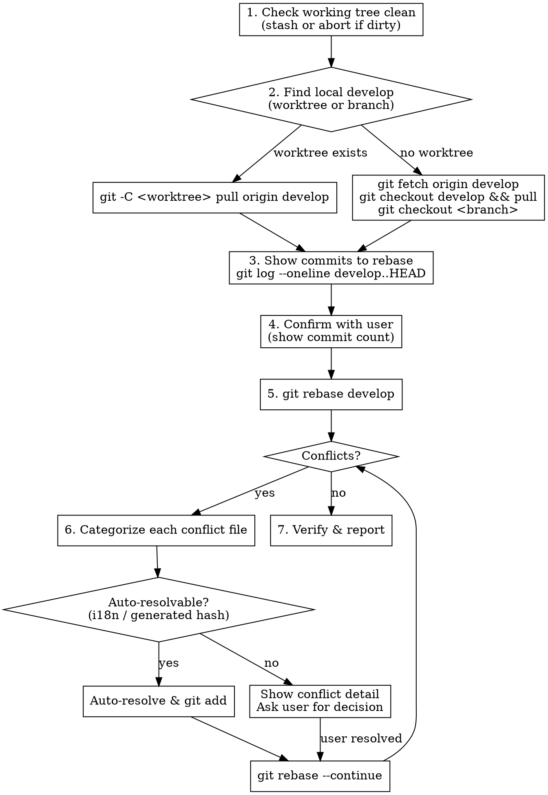

# Rebase Current Branch onto Latest Develop

## Overview

Pull the latest remote `develop` into the local develop (worktree or regular branch), then rebase the current working directory's branch onto it. **Conflicts are analyzed and categorized** — simple ones can be auto-resolved, complex ones (especially binary/prefab files) require user decision.

## Workflow



## Step-by-Step

### 1. Pre-flight Checks

```bash
# Must be clean
git status --short
# If dirty: warn user, do NOT proceed
```

**If working tree is dirty, STOP and tell the user.** Do not stash automatically — the user may have intentional uncommitted work.

### 2. Update Local Develop

**Detect worktree first:**

```bash
git worktree list
```

| Situation | Command |
|-----------|---------|
| develop worktree exists | `git -C <worktree-path> pull origin develop` |
| develop is local branch only | `git fetch origin develop && git branch -f develop origin/develop` |
| develop doesn't exist locally | `git fetch origin develop && git branch develop origin/develop` |

### 3. Preview & Execute Rebase

```bash
git log --oneline develop..HEAD
```

**自动执行策略（不询问用户）：**
- ≤10 commits：直接显示 "共 N 个 commit，正在 rebase..." 然后立即执行 `git rebase develop`
- >10 commits：显示 commit 数量 + 警告可能产生大量冲突，**等用户确认后**再执行

```bash
git rebase develop
```

### 5. Handle Conflicts (CRITICAL)

When rebase stops on a conflict, run:

```bash
git diff --name-only --diff-filter=U   # list conflicted files
```

**Categorize EVERY conflicted file before taking any action:**

#### Category A: Auto-Resolvable (resolve without asking)

| File Pattern | Strategy |
|-------------|----------|
| `assets/resources/i18n/*.ts` — single-line JSON `languages` object | Parse both sides, merge keys (develop wins on duplicates), sort keys, write back with original line endings |
| Auto-generated files with only hash/checksum comment conflicts (e.g. `@CreateDate: <hash>`) | Keep HEAD (develop) version of the hash line |
| `.meta` files with only `uuid`/`ver` line conflicts | Keep HEAD (develop) version |

**Auto-resolve script for i18n files (handle CRLF):**

```javascript
// Normalize \r\n → \n before parsing, restore original line endings after
const content = fs.readFileSync(fp, "utf8");
const hasCRLF = content.includes("\r\n");
const normalized = content.replace(/\r\n/g, "\n").replace(/\r/g, "\n");
// ... parse HEAD and ours, merge keys ...
const result = hasCRLF ? merged.replace(/\n/g, "\r\n") : merged;
```

After auto-resolving: `git add <file> && git rebase --continue`

Tell the user what was auto-resolved and how.

#### Category B: Needs User Decision (ALWAYS ASK)

| File Pattern | Why |
|-------------|-----|
| `.prefab` files | Binary-like JSON, semantic meaning not parseable by diff — position, UUID, component references can silently break |
| `.scene` files | Same as prefab |
| Image/binary files (`.png`, `.jpg`, `.atlas`, `.skel`) | Cannot merge |
| Complex code conflicts (>3 conflict markers, or logic interleaving) | Risk of breaking semantics |

**For these files, present to user:**

1. Which commit is being applied (show commit message)
2. File path and conflict type
3. Options:
   - `--ours` (keep develop version, discard this commit's changes to this file)
   - `--theirs` (keep feature branch version)
   - Manual resolution (user edits in IDE)
   - `git rebase --skip` (skip entire commit)

**Example prompt to user:**

```
冲突文件: assets/resources/games/Stall/prefab/dialog/StallMainUIPrefab.prefab
当前正在应用 commit: a602fdb "feat(stall): 摆摊交易系统 - 资源、prefab 与基础设施"
这是 prefab 文件，无法自动合并。

请选择:
1. 保留 develop 版本 (git checkout --ours)
2. 保留当前分支版本 (git checkout --theirs)
3. 我手动在编辑器中解决，解决后告诉我继续
4. 跳过这个 commit (git rebase --skip)
```

#### Category C: Code Conflicts — Analyze Then Decide

For `.ts` / `.js` / other code files with conflicts:

1. Count conflict regions: `grep -c "<<<<<<" <file>`
2. **1 个冲突区域 + 改动隔离**（如仅 import 行、单个函数新增、单行属性变更）→ **直接解决，不问用户**，事后汇报
3. **2-3 个冲突区域 + 改动逻辑清晰**（如各自独立的新增代码块）→ **直接解决，不问用户**，事后汇报
4. **>3 个冲突区域**，或冲突涉及**逻辑交织/同一函数内双方都有改动** → 展示冲突摘要，**询问用户**

### 6. Repeat Until Complete

After each `git rebase --continue`, check if more conflicts arise. Repeat categorization for each new stop.

### 7. Final Verification

```bash
git log --oneline -5          # confirm new commit hashes
git status                     # confirm clean state
git log --oneline develop..HEAD | wc -l   # confirm commit count
```

Report:
- New HEAD commit hash
- Total commits rebased (note any dropped by git)
- How many conflicts were auto-resolved vs user-resolved
- Whether any commits were skipped

## Common Pitfalls

| Pitfall | Prevention |
|---------|-----------|
| i18n files have `\r\n` line endings, `===` comparison fails | Always normalize before comparing, restore after |
| Force-pushing after rebase without user consent | **NEVER auto-push.** Ask "需要 force push 到远程吗?" |
| Prefab files look like JSON but have semantic UUID references | **NEVER auto-merge prefab.** Always ask user. |
| `git rebase --continue` requires staged files | Always `git add` resolved files before continuing |
| Worktree develop branch can't be checked out in main repo | Use `git -C <worktree>` or `git branch -f` instead of checkout |
| User has uncommitted changes | Check `git status` FIRST, do not stash automatically |

## What NOT to Do

- Do NOT use `git rebase -i` (interactive mode requires TTY input)
- Do NOT auto-resolve prefab/scene files — they contain UUID cross-references that break silently
- Do NOT `git push --force` without explicit user confirmation
- Do NOT stash user's changes automatically — warn and stop
- Do NOT skip commits without asking — even if the conflict looks trivial
